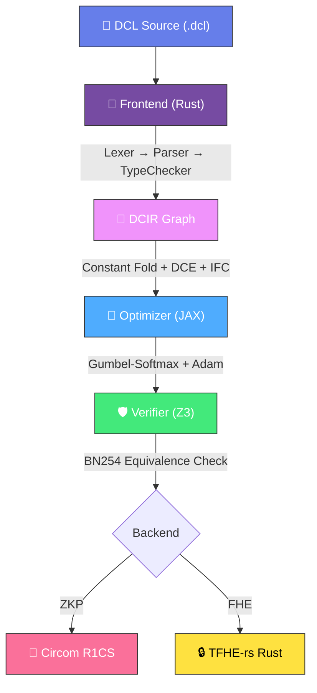

# 🔮 DCL — Differentiable Cryptographic Language

[]()
[]()
[]()

**DCL** is a domain-specific programming language that unifies **Zero-Knowledge Proofs (ZKP)** and **Fully Homomorphic Encryption (FHE)** under a single, type-safe compiler. It uses **differentiable programming** (via JAX + Gumbel-Softmax) to automatically optimize constraint implementation strategies, and **Z3 SMT solving** to formally verify that optimizations preserve semantic correctness.

## ✨ Key Innovations

| Feature | Description | Competitors |
|---------|-------------|-------------|
| 🧠 **Differentiable Strategy Optimization** | Uses JAX gradient descent with Gumbel-Softmax to select optimal circuit strategies | None |
| 🔌 **Dual Backend: ZKP + FHE** | One source file compiles to both Circom (ZKP) and TFHE-rs (FHE) | None |
| 🛡️ **Formal Equivalence Verification** | Z3 SMT solver proves optimized circuit = original for ALL inputs | None |
| 🔒 **Static Information Flow Analysis** | Detects private→public data leaks at compile time | None |

## 📦 Installation

### Prerequisites

- **Rust** 1.70+ with Cargo
- **Python** 3.9+ with pip
- (Optional) [JAX](https://github.com/google/jax) for differentiable optimization
- (Optional) [z3-solver](https://pypi.org/project/z3-solver/) for formal verification

### Build from Source

```bash
# Clone the repository
git clone <repository-url>
cd dcl

# Build the compiler
cargo build --release

# Install Python dependencies
pip install jax jaxlib z3-solver

# Verify installation
cargo test --workspace
```

The compiled binary is at `target/release/dcl-cli`.

## 🚀 Quick Start

### 1. Initialize a Project

```bash
dcl init --name my_circuit
```

### 2. Write a DCL Program

```dcl
module AgeVerification

type Credential = {
    age: Field,
    id_hash: Field
}

circuit verify_adult(
    private cred: Credential,
    public threshold: Field
) -> bool {
    assert cred.age >= threshold;
    let computed_hash = poseidon(cred.age, cred.id_hash);
    return computed_hash == cred.id_hash;
}
```

### 3. Check and Compile

```bash
# Type-check only
dcl check src/main.dcl

# Compile to Circom (ZKP)
dcl compile src/main.dcl --backend circom

# Compile to TFHE-rs (FHE)
dcl compile src/main.dcl --backend fhe -o output.rs

# Compile with verbose output and IR export
dcl compile src/main.dcl --verbose --emit-ir
```

### 4. Format Code

```bash
dcl fmt src/main.dcl
```

## 📖 Language Reference

### Types

| Type | Description | Example |
|------|-------------|---------|
| `Field` | BN254 prime field element | `let x: Field = 42;` |
| `bool` | Boolean value | `let b: bool = true;` |
| `u8` | Constrained unsigned 8-bit integer | `let age: u8 = 25;` |
| `u16` | Constrained unsigned 16-bit integer | `let val: u16 = 1000;` |
| `u32` | Constrained unsigned 32-bit integer | `let id: u32 = 12345;` |
| `u64` | Constrained unsigned 64-bit integer | `let ts: u64 = 0;` |
| `Field[N]` | Fixed-size array | `let arr: Field[4] = ...;` |
| Struct | Named product type | `type Point = { x: Field, y: Field }` |

> **Note**: Constrained integer types (`u8`..`u64`) are sugar for `Field` with automatic range-check insertion at the IR level. A `u8` parameter generates `Input + RangeCheck(8)` constraints.

### Visibility Modifiers

```dcl
circuit verify(
    private secret: Field,    // Hidden from verifier (ZKP witness)
    public  known: Field,     // Visible to all parties
    shared  mpc_val: Field    // Shared across MPC participants
) -> bool { ... }
```

### Control Flow

```dcl
// Immutable by default, mutable with 'mut'
let x = 10;
let mut y = 20;
y = 30;

// Bounded loops (unrolled at compile time)
for i in 0..4 {
    current = poseidon(current, path[i]);
}

// Conditional branches (compiled via Select MUX nodes)
if cond {
    result = x;
} else {
    result = y;
}

// Assertions (compiled to R1CS constraints)
assert x >= threshold;
```

### Standard Library

```dcl
use std::crypto;     // Poseidon hash, Merkle proofs, commitments
use std::fixed;      // Q16.16 fixed-point arithmetic
use std::math;       // abs, min, max, pow, clamp
use std::bits;       // Bitwise AND, OR, XOR, NOT
use std::utils;      // Range checks, select, assert helpers
```

## 🏗️ Architecture



### Compilation Pipeline

| Stage | Language | Key Components |
|:------|:---------|:---------------|
| Frontend | Rust | Lexer, Parser (Pratt), TypeChecker, Formatter |
| DCIR | Rust | DAG IR, SSA merging, constant fold, DCE, IFC analysis |
| Optimizer | Python/JAX | Gumbel-Softmax, Adam, cosine LR, early stopping |
| Verifier | Python/Z3 | BN254 field arithmetic, Poseidon uninterpreted functions |
| Backend | Rust | Circom R1CS generation, TFHE-rs noise management |

## 🧪 Testing

```bash
# Run all tests (unit + integration)
cargo test --workspace

# Run only integration tests
cargo test --test integration_tests

# Run with verbose output
cargo test --workspace -- --nocapture
```

## 📁 Project Structure

```
dcl/
├── crates/
│   ├── dcl-frontend/     # Lexer, Parser, TypeChecker, Formatter
│   ├── dcl-ir/           # DCIR graph, Lowerer, optimization passes
│   ├── dcl-codegen/      # Circom and TFHE-rs code generators
│   └── dcl-cli/          # CLI binary and integration tests
├── dcl-optimizer/
│   ├── optimize.py       # JAX differentiable strategy optimizer
│   └── verify.py         # Z3 SMT formal equivalence verifier
├── stdlib/
│   ├── crypto.dcl        # Poseidon, Merkle, commitments
│   ├── fixed.dcl         # Q16.16 fixed-point math
│   ├── math.dcl          # abs_diff, min, max, pow, clamp, lerp
│   ├── bits.dcl          # Bitwise AND, OR, XOR, NOT, NAND, MUX
│   ├── hash.dcl          # Poseidon wrappers, commitments, nullifiers
│   ├── comparators.dcl   # Equality, ordering, range assertions
│   └── utils.dcl         # Range checks, select, assertions
├── examples/             # Example DCL programs
├── LANGUAGE_SPEC.md      # Formal language specification
├── CHANGELOG.md          # Version history
└── README.md             # This file
```

## 📜 License

MIT License. See [LICENSE](LICENSE) for details.
